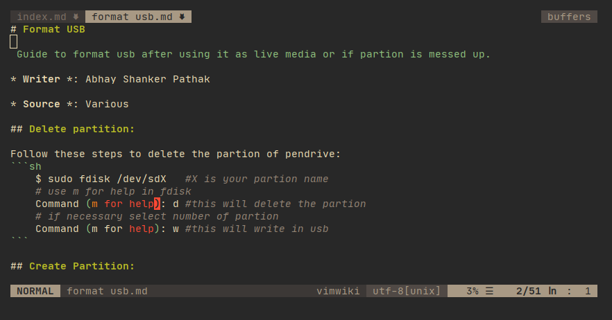
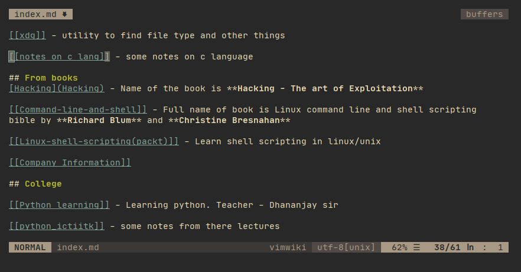

# MY NOTES

Here I put my institutional, personal and other types of notes. I update them as I feel to update. These are for references and things todo. These notes are in `markdown` written in `n/vim` text editor

Visit the `index` file of this repo to get the overlook of notes.
1[tableofcontents](index.md)

### Screenshots

Some screenshots for my notes

`1:`

`2:`

`3:`

